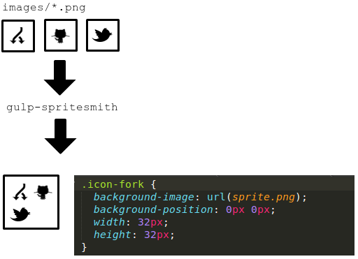

# gulp.spritesmith [](https://travis-ci.org/twolfson/gulp.spritesmith)

Convert a set of images into a spritesheet and CSS variables via [gulp][]

This is the official port of [grunt-spritesmith][], the [grunt][] equivalent of a wrapper around [spritesmith][].

[gulp]: http://gulpjs.com/
[grunt-spritesmith]: https://github.com/Ensighten/grunt-spritesmith
[grunt]: http://gruntjs.com/
[spritesmith]: https://github.com/Ensighten/spritesmith



Alternative output formats include [SASS, Stylus, LESS, and JSON][css-formats].

[css-formats]: #spritesmithparams

### Do you like `gulp.spritesmith`?
[Support us via gratipay][gratipay] or [spread word on Twitter][twitter]

[gratipay]: https://gratipay.com/twolfson/
[twitter]: https://twitter.com/intent/tweet?text=CSS%20sprites%20made%20easy%20via%20gulp.spritesmith&url=https%3A%2F%2Fgithub.com%2Ftwolfson%2Fgulp.spritesmith&via=twolfsn

## Breaking changes in 2.0.0
We have moved to `pixelsmith` as the default `engine`. It is `node` based and should support your sprites. Any other engines must be installed outside of `spritesmith`. This will lead to cleaner and faster installations.

We have moved to `binary-tree` as the default `algorithm`. We changed this to give the best possible packing out of the box. If you were using `top-down` as the default, please specify it in your configuration.

We have moved the `cssClass` option for the `css` template to `cssSelector`. This makes it more semantically appropriate and eaiser to find.

## Getting Started
Install the module with: `npm install gulp.spritesmith`

```js
var gulp = require('gulp');
var spritesmith = require('gulp.spritesmith');

gulp.task('sprite', function () {
  var spriteData = gulp.src('images/*.png').pipe(spritesmith({
    imgName: 'sprite.png',
    cssName: 'sprite.css'
  }));
  spriteData.pipe(gulp.dest('path/to/output/'));
});
```

### Continuing the pipeline
In addition to the `spriteData` stream, we offer individual streams for images and CSS. This allows for image optimization and CSS minification.

```js
var gulp = require('gulp');
var csso = require('gulp-csso');
var imagemin = require('gulp-imagemin');
var spritesmith = require('gulp.spritesmith');

gulp.task('sprite', function () {
  // Generate our spritesheet
  var spriteData = gulp.src('images/*.png').pipe(spritesmith({
    imgName: 'sprite.png',
    cssName: 'sprite.css'
  }));

  // Pipe image stream through image optimizer and onto disk
  spriteData.img
    .pipe(imagemin())
    .pipe(gulp.dest('path/to/image/folder/'));

  // Pipe CSS stream through CSS optimizer and onto disk
  spriteData.css
    .pipe(csso())
    .pipe(gulp.dest('path/to/css/folder/'));
});
```

## Documentation
`gulp.spritesmith` presents the `spritesmith` function as its `module.exports`.

### `spritesmith(params)`
[gulp][] plugin that returns a [transform stream][] with 2 [readable stream][] properties.

The input/output streams interact with [vinyl-fs][] objects which are [gulp's][gulp] format of choice.

[transform stream]: http://nodejs.org/api/stream.html#stream_class_stream_transform
[readable stream]: http://nodejs.org/api/stream.html#stream_class_stream_readable
[vinyl-fs]: https://github.com/wearefractal/vinyl-fs

- params `Object` - Container for `gulp.spritesmith` parameters
    - imgName `String` - Filename to save image as
        - Supported image extensions are `.png` and `.jpg/jpeg` (limited to specfic engines)
        - Image format can be overridden via `imgOpts.format`
    - cssName `String` - Filename to save CSS as
        - Supported CSS extensions are `.css` (CSS), `.sass` ([SASS][]), `.scss` ([SCSS][]), `.less` ([LESS][]), `.styl/.stylus` ([Stylus][]), and `.json` ([JSON][])
        - CSS format can be overridden via `cssFormat`
    - imgPath `String` - Optional path to use in CSS referring to image location
    - padding `Number` - Optional amount of pixels to include between images
        - By default we use no padding between images (`0`)
        - An example usage can be found in the [Examples section](#padding)
    - algorithm `String` - Optional method for how to pack images
        - By default we use `binary-tree`, which packs images as efficiently as possible
        - More information can be found in the [Algorithms section](#algorithms)
    - algorithmOpts `Object` - Options to pass through to algorithm
        - For example we can skip sorting in some algorithms via `{algorithmOpts: {sort: false}}`
          - This is useful for sprite animations
      - See your algorithm's documentation for available options
          - https://github.com/twolfson/layout#algorithms
    - engine `String` - Optional image generating engine to use
        - By default we use `pixelsmith`, a `node` based engine that supports all common image formats
        - More information can be found in the [Engines section](#engines)
    - engineOpts `Object` - Options to pass through to engine for settings
        - For example `phantomjssmith` accepts `timeout` via `{engineOpts: {timeout: 10000}}`
      - See your engine's documentation for available options
    - imgOpts `Object` - Options to pass through to engine uring export
        - For example `gmsmith` supports `quality` via `{exportOpts: {quality: 75}}`
        - See your engine's documentation for available options
    - cssFormat `String` - CSS format to use
        - By default this is the format inferred by `cssName's` extension
            - For example `.styl -> stylus`
        - For more format options, see our formatting library
            - https://github.com/twolfson/json2css#templates
    - cssTemplate `String|Function` - CSS template to use for rendering output CSS
        - This overrides `cssFormat`
        - If a `String` is provided, it must be a path to a [mustache][] template
        - If a `Function` is provided, it must have a signature of `function (params)`
        - For more templating information, see the [Templating section](#templating)
    - cssVarMap `Function` - Mapping function for each filename to CSS variable
        - For more information, see [Variable mapping](#variable-mapping)
    - cssOpts `Object` - Options to pass through to templater
        - For example `{cssOpts: {functions: false}}` skips output of mixins
        - See your template's documentation for available options
            - https://github.com/twolfson/json2css#templates

[SASS]: http://sass-lang.com/
[SCSS]: http://sass-lang.com/
[sass-maps]: http://sass-lang.com/documentation/file.SASS_REFERENCE.html#maps
[LESS]: http://lesscss.org/
[Stylus]: http://learnboost.github.com/stylus/
[JSON]: http://json.org/
[mustache]: http://mustache.github.io/

**Returns**:
- spriteData [`stream.Transform`][transform stream] - Stream that outputs image and CSS as [vinyl-fs][] objects
- spriteData.img [`stream.Readable`][readable stream] - Stream for image output as a [vinyl-fs][] object
- spriteData.css [`stream.Readable`][readable stream] - Stream for CSS output as a [vinyl-fs][] object

### Algorithms
Images can be laid out in different fashions depending on the algorithm. We use [`layout`][] to provide you as many options as possible. At the time of writing, here are your options for `algorithm`:

[`layout`]: https://github.com/twolfson/layout

|         `top-down`        |          `left-right`         |         `diagonal`        |           `alt-diagonal`          |          `binary-tree`          |
|---------------------------|-------------------------------|---------------------------|-----------------------------------|---------------------------------|
| ![top-down][top-down-img] | ![left-right][left-right-img] | ![diagonal][diagonal-img] | ![alt-diagonal][alt-diagonal-img] | ![binary-tree][binary-tree-img] |

[top-down-img]: https://raw.githubusercontent.com/twolfson/layout/2.0.2/docs/top-down.png
[left-right-img]: https://raw.githubusercontent.com/twolfson/layout/2.0.2/docs/left-right.png
[diagonal-img]: https://raw.githubusercontent.com/twolfson/layout/2.0.2/docs/diagonal.png
[alt-diagonal-img]: https://raw.githubusercontent.com/twolfson/layout/2.0.2/docs/alt-diagonal.png
[binary-tree-img]: https://raw.githubusercontent.com/twolfson/layout/2.0.2/docs/binary-tree.png

More information can be found in the [`layout`][] documentation:

https://github.com/twolfson/layout

### Templating
The `cssTemplate` option allows for using a custom template. An example template can be found at:

https://github.com/twolfson/json2css/blob/4.2.0/lib/templates/stylus.template.mustache

The parameters passed into your template are known as `params`. We add some normalized properties via[`json2css`][] for your convenience.

- params `Object` Container for parameters
    - items `Object[]` - Array of sprite information
        - name `String` - Name of the sprite file (sans extension)
        - x `Number` - Horizontal position of sprite's left edge in spritesheet
        - y `Number` - Vertical position of sprite's top edge in spritesheet
        - width `Number` - Width of sprite
        - height `Number` - Height of sprite
        - total_width `Number` - Width of entire spritesheet
        - total_height `Number` - Height of entire spritesheet
        - image `String` - Relative URL path from CSS to spritesheet
        - escaped_image `String` - URL encoded `image`
        - source_image `String` - Path to the original sprite file
        - offset_x `Number` - Negative value of `x`. Useful to `background-position`
        - offset_y `Number` - Negative value of `y`. Useful to `background-position`
        - px `Object` - Container for numeric values including `px`
            - x `String` - `x` suffixed with `px`
            - y `String` - `y` suffixed with `px`
            - width `String` - `width` suffixed with `px`
            - height `String` - `height` suffixed with `px`
            - total_width `String` - `total_width` suffixed with `px`
            - total_height `String` - `total_height` suffixed with `px`
            - offset_x `String` - `offset_x` suffixed with `px`
            - offset_y `String` - `offset_y` suffixed with `px`
      - options `Object` - Options passed in via `cssOpts` in `grunt-spritesmith` config

[`json2css`]: https://github.com/twolfson/json2css

An example sprite `item` is

```js
{
  "name": "sprite2",
  "x": 10,
  "y": 20,
  "width": 20,
  "height": 30,
  "total_width": 80,
  "total_height": 100,
  "image": "nested/dir/spritesheet.png",
  "escaped_image": "nested/dir/spritesheet.png",
  "source_image": "path/to/original/sprite.png",
  "offset_x": -10,
  "offset_y": -20,
  "px": {
    "x": "10px",
    "y": "20px",
    "width": "20px",
    "height": "30px",
    "total_width": "80px",
    "total_height": "100px",
    "offset_x": "-10px",
    "offset_y": "-20px"
  }
}
```

Example usages can be found as:

- [Mustache template](#mustache-template)
- [Template function](#template-function)

#### Variable mapping
The `cssVarMap` option allows customization of the CSS variable names

> If you would like to customize CSS selectors in the `css` template, please see https://github.com/twolfson/json2css#css

Your `cssVarMap` should be a function with the signature `function (sprite)`. It will receive the same parameters as `items` from [Templating](#templating) except for `escaped_image`, `offset_x`,` offset_y`, and `px`.

```js
// Prefix all sprite names with `sprite-` (e.g. `home` -> `sprite-home`)
cssVarMap: function (sprite) {
  sprite.name = 'sprite_' + sprite.name;
}

// Generates:
// $sprite_fork_x = 0px;
// $sprite_fork_y = 0px;

// As oppposed to default:
// $fork_x = 0px;
// $fork_y = 0px;
```

### Engines
An engine can greatly improve the speed of your build (e.g. `canvassmith`) or support obscure image formats (e.g. `gmsmith`).

All `spritesmith` engines adhere to a common specification and test suite:

https://github.com/twolfson/spritesmith-engine-test

Below is a list of known engines with their tradeoffs:

#### pixelsmith
[`pixelsmith`][] is a `node` based engine that runs on top of [`get-pixels`][] and [`save-pixels`][].

[`pixelsmith`]: https://github.com/twolfson/pixelsmith
[`get-pixels`]: https://github.com/mikolalysenko/get-pixels
[`save-pixels`]: https://github.com/mikolalysenko/save-pixels

**Key differences:** Doesn't support uncommon image formats (e.g. `tiff`) and not as fast as a compiled library (e.g. `canvassmith`).

#### phantomjssmith
[`phantomjssmith`][] is a [phantomjs][] based engine. It was originally built to provide cross-platform compatibility but has since been succeeded by [`pixelsmith`][].

**Requirements:** [phantomjs][] must be installed on your machine and on your `PATH` environment variable. Visit [the phantomjs website][phantomjs] for installation instructions.

**Key differences:** `phantomjs` is cross-platform and supports all image formats.

[`phantomjssmith`]: https://github.com/twolfson/phantomjssmith
[phantomjs]: http://phantomjs.org/

#### canvassmith
[`canvassmith`][] is a [node-canvas][] based engine that runs on top of [Cairo][].

**Requirements:** [Cairo][] and [node-gyp][] must be installed on your machine.

Instructions on how to install [Cairo][] are provided in the [node-canvas wiki][].

[node-gyp][] should be installed via `npm`:

```bash
npm install -g node-gyp
```

**Key differences:** `canvas` has the best performance (useful for over 100 sprites). However, it is `UNIX` only.

[`canvassmith`]: https://github.com/twolfson/canvassmith
[node-canvas]: https://github.com/learnboost/node-canvas
[Cairo]: http://cairographics.org/
[node-canvas wiki]: (https://github.com/LearnBoost/node-canvas/wiki/_pages
[node-gyp]: https://github.com/TooTallNate/node-gyp/

#### gmsmith
[`gmsmith`][] is a [`gm`][] based engine that runs on top of either [Graphics Magick][] or [Image Magick][].

**Requirements:** Either [Graphics Magick][] or [Image Magick][] must be installed on your machine.

For the best results, install from the site rather than through a package manager (e.g. `apt-get`). This avoids potential transparency issues which have been reported.

[Image Magick][] is implicitly discovered. However, you can explicitly use it via `engineOpts`

```js
{
  engineOpts: {
    imagemagick: true
  }
}
```

**Key differences:** `gmsmith` allows for configuring image quality whereas others do not.

[`gmsmith`]: https://github.com/twolfson/gmsmith
[`gm`]: https://github.com/aheckmann/gm
[Graphics Magick]: http://www.graphicsmagick.org/
[Image Magick]: http://imagemagick.org/

## Examples
### Algorithm
In this example, we are using the `alt-diagonal` algorithm to guarantee no overlap if images overflow.

**Configuration:**

```js
{
  imgName: 'sprite.png',
  cssName: 'sprite.styl',
  algorithm: 'alt-diagonal'
}
```

**Output:**


### Engine
In this example, we are using the `phantomjssmith` engine as an alternative to the `pixelsmith` default.

**Requirements:**

Install `phantomjssmith` to our `node_modules` via `npm install`.

```bash
npm install phantomjssmith
```

Alternatively, we can use `--save` or `--save-dev` to save to our `package.json's dependencies` or `devDependenices`.

```bash
npm install phantomjssmith --save  # Updates {"dependencies": {"phantomjssmith": "1.2.3"}}
npm install phantomjssmith --save-dev  # Updates {"devDependencies": {"phantomjssmith": "1.2.3"}}
```

**Configuration:**

```js
// var phantomjssmith = require('phantomjssmith');
{
  imgName: 'sprite.png',
  cssName: 'sprite.styl',
  engine: phantomjssmith
}
```

**Output:**


### Padding
The `padding` option allows for inserting spacing between images.

**Configuration:**

```js
{
  imgName: 'sprite.png',
  cssName: 'sprite.styl',
  padding: 20 // Exaggerated for visibility, normal usage is 1 or 2
}
```

**Output:**


### Mustache template
In this example, we will use `cssTemplate` with a `mustache` template to generate CSS that uses `:before` selectors.

**Template:**

```mustache
{{#items}}
.icon-{{name}}:before {
  display: block;
  background-image: url({{{escaped_image}}});
  background-position: {{px.offset_x}} {{px.offset_y}};
  width: {{px.width}};
  height: {{px.height}};
}
{{/items}}
```

**Configuration:**

```js
{
  imgName: 'sprite.png',
  cssName: 'sprite.css',
  cssTemplate: 'mustacheStr.css.mustache'
}
```

**Output:**

```css
.icon-fork:before {
  display: block;
  background-image: url(sprite.png);
  background-position: 0px 0px;
  width: 32px;
  height: 32px;
}
.icon-github:before {
/* ... */
```

### Template function
In this example, we will use `cssTemplate` with a custom function that generates YAML.

**Configuration:**

```js
// var yaml = require('js-yaml');
{
  imgName: 'sprite.png',
  cssName: 'sprite.yml',
  cssTemplate: function (params) {
    // Convert items from an array into an object
    var itemObj = {};
    params.items.forEach(function (item) {
      // Grab the name and store the item under it
      var name = item.name;
      itemObj[name] = item;

      // Delete the name from the item
      delete item.name;
    });

    // Return stringified itemObj
    return yaml.safeDump(itemObj);
  }
}
```

**Output:**

```yaml
fork:
  x: 0
  "y": 0
  width: 32
  height: 32
  source_image: /home/todd/github/gulp.spritesmith/docs/images/fork.png
  image: sprite.png
  total_width: 64
  total_height: 64
  offset_x: -0.0
  offset_y: -0.0
  px:
    x: 0px
    "y": 0px
    offset_x: 0px
    offset_y: 0px
    height: 32px
    width: 32px
    total_height: 64px
    total_width: 64px
  escaped_image: sprite.png
github:
# ...
```

## Contributing
In lieu of a formal styleguide, take care to maintain the existing coding style. Add unit tests for any new or changed functionality. Lint via `npm run lint` and test via `npm test`.

## Attribution
GitHub and Twitter icons were taken from [Alex Peattie's JustVector Social Icons][justvector].

Fork designed by [P.J. Onori][onori] from The Noun Project.

[justvector]: http://alexpeattie.com/projects/justvector_icons/
[noun-fork-icon]: http://thenounproject.com/noun/fork/#icon-No2813
[onori]: http://thenounproject.com/somerandomdude

## Unlicense
As of Feb 09 2014, Todd Wolfson has released this repository and its contents to the public domain.

It has been released under the [UNLICENSE][].

[UNLICENSE]: UNLICENSE
